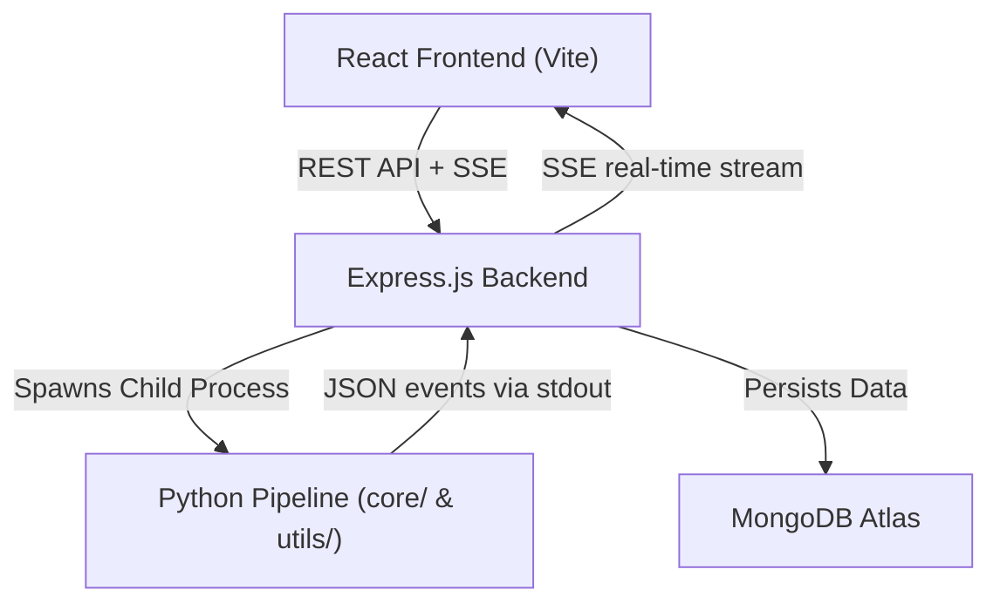

# 🚀 AI_Video_Agent — Meeting Intelligence Platform

AI_Video_Agent is a premium, full-stack MERN application that transforms long meeting recordings or YouTube links into structured intelligence summaries, actionable items, and an interactive Q&A chatbot using **LangChain RAG (Retrieval-Augmented Generation)**.

---

## 📸 Interface Preview
*Featuring a premium, glassmorphic dark-theme UI with electric-violet and cyan accents.*

---

## 🏗️ Architecture Flow



### ⚡ Hybrid Spawner Design
- **Node.js/Express** acts as the scalable API gateway, file manager, and database coordinator.
- **Python Core** hosts the heavy AI processing models (Whisper, Mistral, ChromaDB). Express spawns Python processes asynchronously and streams real-time stdout updates to the React client via **Server-Sent Events (SSE)**.

---

## 🌟 Key Features

- **🛸 Premium Dark UI**: Frosted glassmorphism design with fluid hover cards, responsive grid, and clean layouts.
- **📈 6-Stage AI Pipeline**:
  1. **Audio Extraction**: Converts video formats or downloads YouTube links using `yt-dlp` and `pydub`.
  2. **Transcription Engine**: Route speech-to-text to local **Whisper** (English) or **Sarvam AI** cloud (Hinglish/Translation).
  3. **Title Generation**: Automated title creation based on the discussion topics.
  4. **Bullet Summarization**: Summarizes transcripts into structured professional logs.
  5. **Insight Extraction**: Extracts actionable items, decisions, and follow-up open questions.
  6. **RAG Database Building**: Sets up an vector database using **ChromaDB** and HuggingFace embeddings.
- **💬 Isolated Q&A Chatbot**: Chat with your meeting transcript. Each meeting is allocated an isolated database (`vector_db_<meeting_id>`) to prevent information cross-contamination.
- **🗑️ Database Auto-Cleanup**: Automatically deletes the associated vector database directories on disk when a meeting is deleted from MongoDB.

---

## 🛠️ Tech Stack

- **Frontend**: React (Vite), Framer Motion, Lucide Icons, Axios, Tailwind/CSS Custom Variables
- **Backend**: Node.js, Express.js, Mongoose, Multer (File Uploads), SSE
- **Database**: MongoDB Atlas (Persistent History), ChromaDB (Vector Store)
- **AI Core**: Python 3, LangChain (LCEL), Mistral AI, Sarvam AI, Whisper (OpenAI), Pydub, HuggingFace Embeddings

---

## 🚦 Getting Started

### 📋 Prerequisites
1. **Node.js** (v18+)
2. **Python** (v3.9+) with virtual environment activated
3. **MongoDB** (Atlas connection or local server)
4. **FFmpeg** installed (Whisper and Pydub dependency)

---

### 📦 Installation

1. **Clone the Repository**:
   ```bash
   git clone https://github.com/dhangar007A/AI-Video-Assistant.git
   cd AI-Video-Assistant
   ```

2. **Configure Python Environment**:
   ```bash
   python -m venv .venv
   # Windows Activation:
   .venv\Scripts\activate
   # macOS/Linux Activation:
   source .venv/bin/activate

   pip install -r Requirements.txt
   ```

3. **Install Node Dependencies**:
   ```bash
   # Server (Backend)
   cd server
   npm install

   # Client (Frontend)
   cd ../client
   npm install
   ```

---

### 🔑 Environment Variables Setup

#### 1. Root Directory `.env`
Create a `.env` in the root folder for Python dependencies:
```env
MISTRAL_API_KEY = "your_mistral_api_key"
SARVAM_API_KEY = "your_sarvam_api_key"
WHISPER_MODEL = "small"
SARVAM_STT_MODEL = "saaras:v2.5"
```

#### 2. Backend Server Directory `server/.env`
Create a `.env` in the `server` folder:
```env
PORT = 5000
MONGODB_URI = "your_mongodb_connection_uri"
PYTHON_PATH = "python"
PROJECT_ROOT = ".."
```

---

### 🚀 Running the App

1. **Start the Express Server**:
   ```bash
   cd server
   npm start
   ```
   *Runs on `http://localhost:5000`*

2. **Start the Vite Client**:
   ```bash
   cd client
   npm run dev
   ```
   *Runs on `http://localhost:3000`*

3. Open your browser and navigate to **[http://localhost:3000](http://localhost:3000)**.
